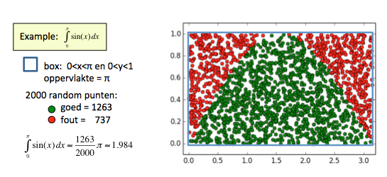

# Monte Carlo

## tl;dr

Schrijf een functie die middels de Monte Carlo-methode de integraal berekent van een willekeurige wiskundige functie.

## Achtergrond

Gegeven $$f(x)$$ op $$a \leq x \leq b$$, bereken $$\int_a^b f(x)~dx$$

Benader de integraal door gebruik te maken van random getallen. Gooi in een gebied (van bekende grootte) rond de integratie regio random punten en kijk welke fractie binnen het integratiegebied valt.

1. Definieer rechthoek dat het integratiegebied omsluit

Definieer een gebied (vaak een rechthoek) dat het de integraalregio omsluit. Kies dus 
een  $$x_{min}$$, $$x_{max}$$, $$y_{min}$$ en $$y_{max}$$ zodanig dat geldt 

  - $$x_{min} \leq a$$ en $$x_{max} \geq b$$

  - voor $$a \leq x \leq b$$ : $$y_{min} \leq f(x)  \leq y_{max}$$

Note: in de meeste toepassingen wordt gekozen voor $$x_{min} = a$$ en $$x_{max} = b$$.

2. Gooi random punten in het rechthoek

Gooi een groot aantal random punten $$(x_i, y_i)$$ in het rechthoek dat het integratiegebied om sluit en 
bekijk voor elk punt of het binnen het integratiegebied valt ('goed') of erbuiten ('fout'). Hou bij welke 
fractie van de punten in het integratiegebied valt: $$f_{goed}$$.

3. Bepaal de integraal

De integraal is de fractie punten die binnen de grafiek vallen keer de oppervlakte van de totale box. 
In het geval van een rechthoek wordt dat gegeven door :
$$
    \int_a^b f(x)~dx = f_{goed}~~\cdot~(x_{max}-x_{min})\cdot(y_{max}-y_{min})
$$

## Voorbeeld: $$\int_{0}^{\pi}sin(x)~dx$$

Van de functie $$sin(x)$$ weten we dat het op het domein $$0 < x < \pi$$ tussen de 0 en de 1 ingesloten ligt. We 
definieren dan ook een box om het integratiegebied heen en 2000 random punten gegooid. Daarvan bleek 63.15% 
(1263/2000) binnen het integratiegebied te vallen. De schatting die we maken van de integraal met behulp van 
deze 2000 punten is dan ook: 0.6315$$\pi \approx 1.984$$. Zodra dit werkt kunnen we natuurlijk ook 1 miljoen 
punten gooien in plaats van 2000. 

## Specificatie

Schrijf een functie die integralen kan berekenen met behulp van de Riemannsom. Zorg dat je deze vervolgens test voor de volgende functies:

1. $$\int_{0}^{1}x^{x+\frac{1}{2}} ~dx$$

	Hint: test je functie door te testen of je programma de integraal $$\int_{0}^{1}x^2 dx$$ goed voorspelt

2. $$\int_{0.2}^{2.2} \tan(\cos(\sin(x))) ~dx$$

	Hint: test je functie door te testen of je programma de integraal $$\int_{0}^{\pi}sin(x) dx$$ goed voorspelt

3. $$\int_{0}^{\pi} sin(x^2) dx$$

	Hint: Let goed op wat je doet met de negatieve integratieregio's. Het is handig om de oppervlakte van die gebieden zelfstandig te evalueren.

4. het Twitter-ei

	Schrijf een programma `TwitterEi()` dat de oppervlakte van het Twitter-Ei berekent. De omtrek van het ei wordt gegeven door: 
	
	$$ \sqrt{x^2+y^2} + \frac{2}{3}\sqrt{x^2+\left(\frac{5}{6}-y \right)^2 } = 1$$

	Teken de 'slechte' punten in het blauw op het scherm zoals in onderstaande voorbeeld.

	

Bewaar na elke 100 punten dat je gooit de schatting van de oppervlakte op dat moment. Plot aan het eind van je programma ook de verdeling van de schatting van de oppervlakte als functie van het aantal punten dat je gegooid hebt (dit hoort bij de opdracht!). Hopelijk zie je dat het antwoord convergeert en dat je een betere schatting krijgt naarmate je meer punten gooit.

## Tips

- Maak altijd een plaatje van je grafiek zodat je duidelijk ziet welk gebied je aan het integreren bent.

- Maak ook een grafiek met rode en groene punten zoals in bovenstaand voorbeeld. Mocht je een fout gemaakt hebben in je logica dan zie je dat in een plaatje in 1 keer terwijl je daar anders uren naar moet zoeken in de code zelf.

- test je programma altijd op een (vergelijkbare) integraal die je wel analytisch kan uitrekenen. 

- specifiek voor Monte Carlo: bij 'negatieve' integratieregio's de gebieden splitsen

- In 'echte' toepassingen wordt voor efficientie maximalisatie de box zo gekozen dat hij de integraal zo nauw mogelijk omsluit: grootste fractie 'goede' worpen.
