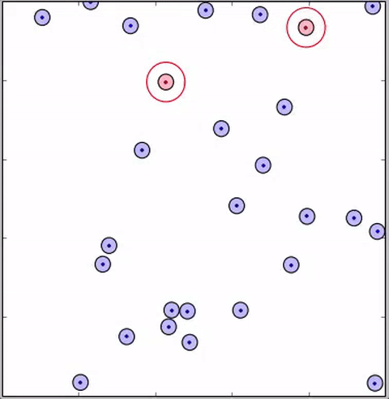

## Opdracht 2: Harde realiteit voor de konijnen: vossen

Je kan natuurlijk de hele middag kijken naar 25 konijnen die over je scherm door een fictief bos rennen, maar daar is verder niks spannends of ingewikkelds aan. Laten we wat spektakel toevoegen.

 

#### Deelopdracht (2a): introduceren van vossen

Naast konijnen zijn er ook vossen in het bos. Pas de code zo aan de er ook (twee) vossen in de simulatie meedoen en op het scherm verschijnen. In grote lijnen kan je dezelfde structuur volgen die we ook voor de konijnen gebruikt hebben. Maak eerst lijsten die de positie en bewegingsrichtingen van de vossen beschrijven en maak ook een nieuwe functie `verplaats_de_vossen()`, die je in de functie `prooipredator()` aanroept net na `verplaats_de_konijnen()`, en die de vossen steeds een stap laat zetten. Net als de konijnen zal ook de vos nooit het bos verlaten. Zorg dus dat je voor de vossen dezelfde implementatie maakt voor het ontwijken van de bosrand als voor de konijnen in opgave 1b). Als laatste moet je ook de functie `teken_het_bos()` aanpassen zodat ook de vossen op het scherm getoond worden. 

Er zijn een paar verschillen tussen de vossen en de konijnen:

   - vossen zijn twee keer zo snel als konijnen (`snelheid_vossen = 2`) en ze staan nooit stil
   - teken de vossen in rood (size=10 i.p.v de size=6 voor de konijnen)

Laat de vossen starten op posities (70,70) en (80,80) en laat bij de start vos 1 naar links en vos 2 naar beneden bewegen. 

 

#### Deelopdracht (2b): specifiek wandelgedrag van wolven

{:.inline}{: style="width:30%"}

Net als de konijnen hebben ook vossen een eigen unieke manier van voortbewegen. De vos heeft de neiging om rechtdoor te lopen, maar kan na elke stap besluiten daarna iets naar links of rechts af te buigen. De kans op een bepaalde verandering ten opzichte van de oorspronkelijke bewegingsrichting neemt sterk af hoe groter de richtingsverandering is. De verdeling van de kansen volgt een zogenaamde normaal-verdeling. De vos volgt hiermee een soort pseudo-random walk waarbij er een sterke voorkeur is om in de oorspronkelijke richting te blijven lopen. Implementeer dit gedrag in je simulatie.

<b>Python input:</b> Om een 'random' nieuwe richting te kiezen vanuit een normaalverdeling heb je een functie nodig die zich in de numpy bibliotheek bevindt. Zorgt dat je code die kent: `import numpy` en voor de specifieke implementatie waarin je wilt dat het random getal gecentreerd is rond de oorspronkelijke bewegingsrichting kan je de volgende syntax gebruiken:

{: .language-python}   
     nieuwe_hoek = numpy.random.normal(hoeken_vossen[i_vos], 0.2)  

Laat de vos eerst een stap zetten en kies dan een nieuwe random richting en sla die op in `hoeken_vossen`. Bij de volgende stap zal de vos in deze nieuwe richting bewegen. De waarde 0.2 is de bovenstaande uitdrukking is de zogenaamde breedte van de normaal-verdeling. Het bepaalt hoe makkelijk (of niet) de vos van zijn oorspronkelijke bewegingsrichting af kan wijken.

 

