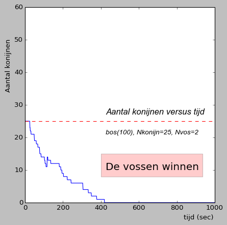
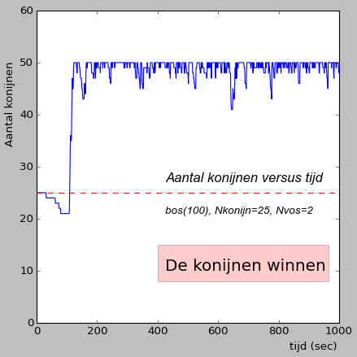

## Opdracht 4: Reproducerende konijnen en overbevolking

We hebben in de vorige opdracht bestudeerd hoe (snel) het aantal konijnen afneemt als er twee vossen in het bos rondlopen. De konijnen zijn bij voorbaat verloren en zullen uiteindelijk allemaal opgegeten worden. Maar in de natuur is dat anders. In de natuur kan het aantal konijnen ook toenemen, want konijnen kunnen zich voortplanten. We gaan in deze opdracht bekijken wat het effect is van reproductie als we dat als element meenemen in onze populatie-simulaties. Tegelijk met een mogelijke toename van het aantal konijnen, en zeker de manier waarop dat meestal gaat, is het ook belangrijk om mee te nemen dat ons bos maar voedsel biedt voor een beperkt aantal konijnen. Beide aspecten gaan we meenemen in onze simulatie.

Het systeem is vrij instabiel en je zal zien dat na 1000 seconden of de konijnen winnen (konijnen zitten tegen het maxmimum aantal aan) of de vossen winnen (alle konijnen zijn opgegeten). De vraag die we in deze opdracht gaan beantwoorden is de volgende: 'hoe vaak winnen de konijnen en hoe vaak winnen de vossen?' Aan het eind van deze opdracht moet op het scherm verschijnen:

{: .language-python}   
     Een gesimuleerde wereld met: Nkonijn=25 (v=1), Nwolf=2 (v=2), Nsimulaties = 200:     
     In XX.X procent van de gevallen winnen de konijnen

We gaan deze vraag in stapjes beantwoorden. Voeg in de functie `prooipredator()` twee nieuwe functies toe: `reproduceren_konijnen()` en `overbevolking()` die deze fenomenen beschrijven. Tijdens het implementeren van beide nieuwe functies doen we dit steeds voor een enkele simulatie. Het is handig om in deze eerste stappen van de opdracht de visualisatie weer 'aan' te zetten.

<b>Let op:</b> we gaan nu een aanpassing aan de bestaande code maken uit. Om te zorgen dat de huidige werkende code goed uit `prooipredator_tm_opdracht3.py` goed bewaard blijft gaan we deze opdracht maken in een nieuw bestand. Maak daarom een nieuw Python bestand aan, `prooipredator_tm_opdracht4.py`, kopieer de code die je tot nu toe hebt gemaakt erin en ga verder in deze nieuwe file.

 

#### Deelopdracht 4a: reproducerende muizen

Het eerste aspect dat we in gaan voeren is het vermogen van de muizen om zich voort te planten. Maak een nieuwe functie `reproduceren_konijnen()` die wordt aangeroepen na de bestaande functies (het verplaatsen van de konijnen, het verplaatsen van de wolven en het opeten van de konijnen door de wolven) en die steeds kijkt of er konijnen dicht bij elkaar zitten. Als dat het geval is moet het programma de nieuwe jongen konijnen op een random plek in het bos neerzetten.

Ga hierbij als volgt te werk:

  1. Roep de functie pas aan na 200 seconden. De konijnen beginnen al erg dicht bij elkaar en zijn in het begin nog te jong om zich voort te planten. Dit is een aanpassing in de functie `prooipredator()` zelf die bepaalt welke functies aangeroepen worden voor elke tijdstap.

  2. Bepaal eerst hoeveel paren konijnen er dicht bij elkaar zitten (afstand < 1). Dit bepaalt het aantal nestjes. <b>Let op:</b> vermijd hierbij dubbeltellen. 

  3. Genereer vervolgens voor elk nestje 4 nieuwe konijnen, geef ze een random positie in het bos, een random bewegingsrichting en voeg ze toe aan de lijst van konijnen.
  
Als je een paar simulaties bekijkt zal je zien dat het een erg instabiel systeem is. Als de vossen nog niet genoeg konijnen hebben opgegeten op het moment dat de konijnen gaan reproduceren kan het aantal konijnen exponentieel groeien. En zo je programma vast laten lopen. In de volgende opdracht gaan we deze ongewenste en onrealistische effecten repareren.
  
 

#### [deelopdracht 4b]: maximum aantal konijnen in het bos

De tweede functionaliteit die we toe gaan voegen is het beperken van het aantal konijnen dat tegelijkertijd in het bos kan leven. Er is maar voldoende voedsel in het bos aanwezig voor 50 konijnen. Maak een nieuwe functie `overbevolking()` die na `reproduceren_konijnen()` aangeroepen wordt. Het doel van deze functie is om te zorgen dat er nooit meer dan 50 konijnen in het bos aanwezig zijn. Kijk dus hoe lang de lijst met konijnen is en verwijder elk element in de lijst van konijnen boven de 50. Let op dat je die konijnen uit alle drie de lijsten verwijdert: x-positie, y-positie en hoek.

Zoals je al gezien hebt is het systeem vrij instabiel. Na 1000 seconden zal je (meestal) in een stabiele toestand belanden. Of de konijnen hebben gewonnen (konijnen zitten tegen het maxmimum van 50 aan) of de vossen hebben gewonnen (bijna alle konijnen zijn opgegeten). De onderstaande grafieken laten het aantal konijnen zien als functie van de tijd voor twee simulaties waarin de vossen hebben gewonnen (links) of de konijnen hebben gewonnen (rechts). Deze grafieken zijn gemaakt met bijna vrijwel dezelfde functie die we in deelopdracht 3c hebben gemaakt om de fractie levende konijnen als functie van de tijd te laten zien.

 {: style="width:40%"}
 {: style="width:40%"}

De opdracht van deze stap is om dit type grafiek te maken voor een enkele simulatie. Op deze manier proberen we onszelf te overtuigen van het feit dat de nieuwe functie `overbevolking()` goed werkt. Schrijf dus een nieuwe functie `winstkans_konijnen()` die een enkele simulatie maakt door de functie `prooipredator()` aan te roepen en een plot maakt voor die simulatie net als de plots hierboven.

<b>Tip:</b> de functie die we hier moeten maken lijkt sterk op de functie `gemiddelde_halfwaardetijd()` die we in opgave 3b en 3c hebben gebruikt. Kopieer die functie en gebruik dat als de 'basis' die je vervolgens aan kan passen aan de iets andere manier van plotten hier. De functie `prooipredator()` gaf na opdracht 3 als return-waarde al het aantal konijnen op elk moment in de tijd. Gebruik die informatie ook hier als basis voor je plot.

Naast het tekenen van de plot is het ook belangrijk om de conclusie te trekken of de konijnen of de vossen gewonnen hebben. Als op tijdstap 1000 het aantal konijnen groter is dan 45 hebben de konijnen gewonnen, als het minder is dan 5 hebben de vossen gewonnen. Elk andere hoeveelheid konijnen betekent dat het een gelijkspel is.

Aan het eind van de simulatie moet de functie op het scherm printen wie gewonnen heeft.

{: .language-python}   
     Het aantal konijnen na t=1000 stappen was XXX.     
     Dit betekent dat de XXX gewonnen heeft.
   
    

#### De opdracht: winstkansen konijnen

We zijn nu in staat de originele vraag in deze opdracht te beantwoorden: wat is de winstkans van de konijnen? Concreter: in welk percentage van de simulaties zijn er na 1000 seconden meer dan 45 konijnen in het bos? Pas de functie `winstkans_konijnen()` uit deel opdracht 4b zo aan dat er nu 200 simulaties gedraaid worden en hou voor elk van de simulaties bij of de konijnen hebben gewonnen (meer dan 45 konijnen), of de vossen hebben gewonnen (minder dan 5 konijnen) of dat er een gelijkspel was (alle andere gevallen).

<b>Let op:</b> de plot die je gemaakt hebt in deelopdracht 4b hoef je nu niet meer te maken voor elk van de 200 simulaties. Zorg dan ook dat de plot alleen gemaakt wordt als de functie `winstkans_konijnen()` maar 1 simulatie draait. 

Bereken na alle simulaties gerund te hebben de gevraagde fractie en print de winstkansen voor de konijnen als volgt op het scherm:

{: .language-python}   
     Een gesimuleerde wereld met: Nkonijn=25 (v=1), Nwolf=2 (v=2), Nsimulaties = 200:     
     In x.x procent van de gevallen winnen de konijnen

### Conclusie
In deze opdracht hebben we een populatie-dynamica simulatie doorgerekend met behulp van de computer. We hebben vrij elementaire aspecten meegenomen en bestudeerd hoe de ontwikkeling van konijnen afhangt van de vrije parameters in het systeem. De 'echte' simulaties die wetenschappers doen werkt op precies dezelfde manier. Of het nou deze populatie-dynamica is, of file-doorstroming op een nieuwe verkeerssituatie of het bewegen van mensen in een noodsituatie in een stadion. Deze simulaties kan makkelijk uitgebreid worden en als je zin hebt kan je dat ook doen. Wat zijn de eerste dingen die je toe zou voegen? Vossen die steeds langzamer gaan lopen als langer niks gegeten hebben, vossen die zich kunnen voortplanten of juist opeten, vossen die konijnen kunnen ruiken als ze in de buurt zitten, konijnen die zich kunnen verstoppen op bepaalde plekken in het bos etc etc. De mogelijkheden zijn eindeloos. Onze tijd die we hebben voor deze module helaas niet.

