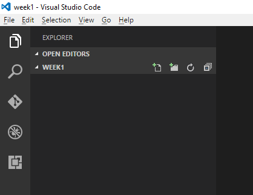

# Proefrit

Nu je zowel Anaconda als Visual Studio Code hebt geïnstalleerd, kunnen we gaan kijken of alles werkt. Voordat we beginnen, maak ergens op jouw computer (bijvoorbeeld de *Desktop*) een map aan genaamd `programmeren`[^1]. Dan heb je een plek om in te werken. Maak vervolgens binnen `programmeren` een map aan genaamd `week1`.  

Open nu Visual Studio Code. Zodra je dit hebt gedaan zie je het volgende scherm:

{:style="max-width:50%"}

Klik linksboven op je beeldscherm (dus niet in het Visual Studio window) in de menubalk op **File** en kies dan onder Windows voor **Open Folder...** en onder Mac voor **Open...**. Open vervolgens de `week1`-map die je hebt aangemaakt. Je ziet dan de volgende sidebar verschijnen. De icoontjes die naast `week1` staan verschijnen alleen als je met de muis in de sidebar staat:

{:style="max-width:50%"}

Maak via deze sidebar een nieuw bestand aan met de knop . Je kunt dan meteen de naam van het bestand ingeven. Noem het bestand `hello.py` (vergeet niet om heel precies `.py` aan het einde van de naam te zetten!).

Krijg je de volgende melding? Klik dan op **Don't show again**. We hebben de extra hulp niet nodig tijdens deze cursus.

Zet hierin de volgende regel code: 

	print "Hello, World!"

Sla het bestand `hello.py` op. En nu het moment van de waarheid: druk op de toetscombinatie **ctrl**+**\`**. Dat is dus tegelijkertijd de **ctrl** en **\`**. Dan zie je het volgende verschijnen in de onderste helft van je Visual Studio scherm:

{:style="max-width:50%"}

Let op: in het voorbeeld hierboven zie je expliciet in welke directory je staat, maar dat hoeft niet altijd zo te zijn.

Dit is de zogenaamde **terminal**, een plek om commando's uit te voeren. Bijvoorbeeld om Python programma's uit te voeren zoals wij zullen gaan doen. Laten we dat dan meteen maar gaan doen met het door ons net gecreeerde Python programma `hello.py`. Voer dan ook het volgende commando in op de terminal-regel:

	python hello.py

Druk op **ENTER** om de opdracht te starten. En inderdaad, jouw eerste (werkende) programma!

## checkpy

Om jou te helpen controleren of wat je programmeert ook daadwerkelijk in overeenstemming is met de opdracht, hebben wij een programma geschreven genaamd **checkpy**. Dit programma kun je installeren door in de terminal het volgende commando uit te voeren:

	pip install checkpy

Dit kan even duren, en je zult wat tekst over je scherm zien gaan. Daarna is checkpy geïnstalleerd. Behalve checkpy hebben we ook tests nodig om de opdrachten die jij zometeen gaat maken te testen. Deze tests kun je downloaden door het volgende commando in de terminal te voeren:

	checkpy -d jelleas/progbeta2017tests

Om te testen of alles werkt, en of `hello.py` klopt, voer je het volgende commando in de terminal uit:

	checkpy hello

Kleurt alles groen en zie je enkel vrolijke smileys? Dan zit je goed, en heb je aan onze eisen voor de opdracht voldaan! Mocht er iets rood kleuren, geen paniek! Kijk goed na of je precies hebt gedaan wat er is gevraagd, en mail gerust als je klem zit.

[^1]: Weet je niet zo goed hoe je mappen moet maken? Kijk eens bij [Apple](https://support.apple.com/en-us/HT201732) voor Mac OS of bij [Dummies.com](http://www.dummies.com/computers/operating-systems/windows-10/how-to-create-a-new-folder-in-windows-10/) voor Windows.
