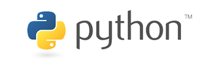

# Inleiding Wetenschappelijk Programmeren <small>Studiehandleiding</small>

*Versie: Lente 2017*

{:.inline}  

We gaan programmeren in Python, een eenvoudige taal met vele mogelijkheden. Je leert over de basis van het programmeren, maar je gaat vooral aan de slag met toepassingen uit de biologie, wiskunde en natuurkunde.

## Opties Module 1 ##

- Zet je eerste stappen en spring op de pyramide met [Mario](/mario/inhoud)
- Duik in de wereld van [Getaltheorie](/getaltheorie/inhoud)

## Opties Module 2 ##

- [Integreer](/integreren/inhoud) zonder moeite de meest exotische functies
- Ga op zoek naar het juiste [DNA](/dna/inhoud)

## Opties Module 3 ##

- Bestudeer de natuurkundige regels van [beweging](/beweging/inhoud)
- Onderzoek het natuurlijke [gedrag](/gedragd/inhoud) van dieren
- Bereken je voordeel bij [Monopoly](/monopoly/inhoud)

## Opties Module 4 ##

- Begraaf je in de big data van het [klimaat](/klimaat/inhoud)

## Medewerkers

Martijn Stegeman  
Ivo van Vulpen  
Jelle van Assema
